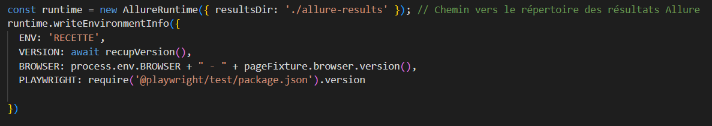
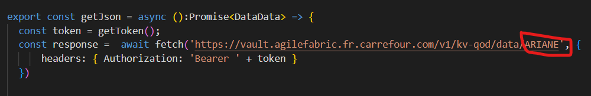
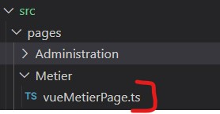
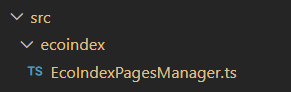
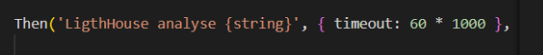
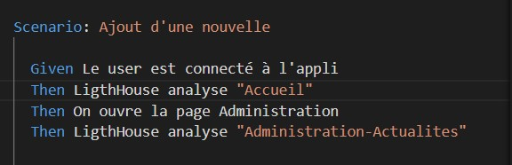
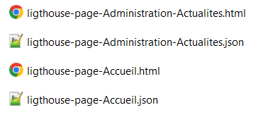
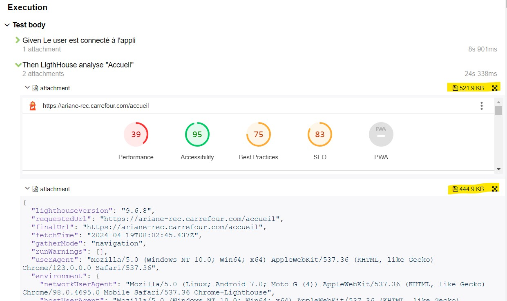

# Playwright_CucumberJS_Allure


## Architecture

Pages :  src/pages  
Features : src/test/feaures
Steps : /src/test/steps

Répertoire src/test/hooks qui contient 3 fichiers:  
+ config.ts : permet de récupérer la config du test (navigateur, url ...)
+ hooks.ts : contient les BeforeAll, AfterAll, Before et After
+ pageFixtures.ts  : contient toutes les données fixes des  tests (id/pwd, objets décrivant les pages)

## MAJ partie ENVIRONNEMENT du reporting Allure
Le code permettant de mettre à jour la partie ENVIRONNEMENT du reporting Allure se trouve dans le fichier connexionSteps.ts  
  
  

````shell script
const runtime = new AllureRuntime({ resultsDir: './allure-results' }); // Chemin vers le répertoire des résultats Allure
  runtime.writeEnvironmentInfo({
    ENV: 'RECETTE',
    VERSION: await recupVersion(),
    BROWSER: process.env.BROWSER + " - " + pageFixture.browser.version(),
    PLAYWRIGHT: require('@playwright/test/package.json').version

  })
````


## Connexion à Vault
Le token est récupéré via la méthode getToken du fichier vault.ts  
Les id/pwd sont renvoyés sous forme ed json via la méthode getJson  


## Lancement du robot
Pour le moment on peut ajouter 3 variables d'environnement dans la ligne de commande qui permet de lancer le robot
+ VIDEO : true/false  (val par défaut = false)
+ HEADLESS : true/false (val par défaut = false)
+ BROWSER : chrome/firefox (val par défaut = fchrome)

Les var doivent être déclarées avant la cde npx

Ex : 
````shell script
VIDEO=true HEADLESS=false  BROWSER=chrome npx cucumber-js --tags  @AjoutNouvelle
````

## Ajout d'une page
+ Ajouter le fichier ts dans src/page/xx  

+ pageFixtures.ts : importer la classe  +  ajouter la propriété associée à la page
Ex : page vueMetierPage.ts

````shell script 
import { VueMetierPage } from "../../pages/Metier/vueMetierPage";  

vueMetierPage: undefined as unknown as VueMetierPage
````
+ hooks.ts : initialiser l'objet   
````shell script 
import { VueMetierPage } from '../../pages/Metier/vueMetierPage';

pageFixture.vueMetierPage = new VueMetierPage(page)
````
 

## Analyse GreenIT

La méthode permettant de demander une récupération des données GreenIT sur une page est contenue dans le fichier EcoIndexPagesManager.ts


Appel de la méthode : 
````shell script 
//GreenIT
  pageFixture.ecoIndexPagesManager.computeAndSavePageScores("Nom de la Page", pageFixture.page)
````
Nom de la page est à remplacer par le nom de la page sur laquelle on fait l'analyse GreenIT (ex : Page Accueil)  
Un fichier GreenIT.json sera généré à la racine du projet

## Audit Ligthouse
Google a développé l'outil Lightouse qui permet de faire un audit des pages par rapport à différents paramètres  
La méthode d'audit a été ajoutée dans un step présent dans le fichier ligthouse.steps.ts   



Pour demander l'audit LH sur une page, il suffit d'ajouter le step dans le scénario, et indiquant le nom de page sur laquelle on fait l'audit:  


Le résultat de l'audit est sauvegardé dans un fichier html et dans un fichier json, dans le répertpoire lighthouse-reporting  
  
  

Les fichiers sont intégrés dans le step du reporting  
  
   
  
Les icônes surlignées en jaune permettent un affichage pleine page des résultats